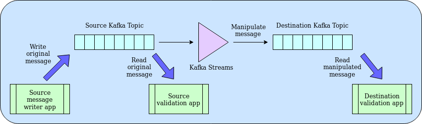

## The Goal

Here is the problem: We have a production Kafka cluster with production data. We also have a dev cluster where we want to have the same data. Except it's dev, so we want to anonymise any customer data and inject duff records to ensure nobody mistakes the dev cluster for a prod one.

Doesn't sound too difficult and I could think of several ways to do it. For example writing an app that reads messages, processes them and pushes them onto another cluster. Except then you have an app you have to maintain, monitor, etc. What we're doing is akin to ETL (Extract - Transform - Load) but in realtime. That said, ETL tools don't tend to be that simple and will require yet another system to be maintained, and possibly licensed.

So my requirements for a good solution: no additional licensing, easy to set up, minimal maintenance, no additional monitoring required.

## The Journey

Having done some research, it seems Kafka Streams does what we want it to do. It looks like you can set it up to move data between Kafka clusters, and you can build filters and other pieces of code that can manipulate the data as it flows through. Worth investigating!

### The plan

Here is what I'm thinking at the moment.

I need an app that allows me to push messages to a topic on a Kafka cluster. Another app reads the messages so we can see the message as it appears on the first Kafka topic. Kafka Streams picks up the message, manipulates it and pushes it to a topic on another Kafka cluster. Finally, an app reads the message so we can validate the manipulation was done.

### Setting up Kafka

Installing Kafka is really easy if you follow the guide. But, I don't want Kafka sitting and running on my machine 24/7, so I'm going to look into using Docker. 

## Key learnings
## End Result
## Useful Links

https://hub.docker.com/r/spotify/kafka/
https://github.com/confluentinc/kafka-streams-examples/blob/master/src/main/java/io/confluent/examples/streams/WordCountLambdaExample.java